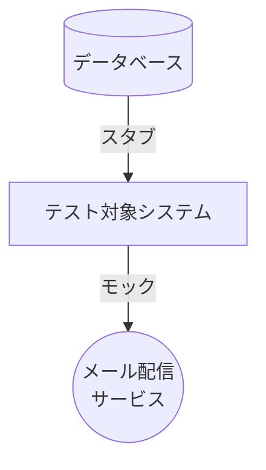

https://www.amazon.co.jp/%E5%8D%98%E4%BD%93%E3%83%86%E3%82%B9%E3%83%88%E3%81%AE%E8%80%83%E3%81%88%E6%96%B9-%E4%BD%BF%E3%81%84%E6%96%B9-Vladimir-Khorikov/dp/4839981728
# 概要
上記の感想・覚書です。
# 単体テストとは
良いテストとは
 - テストすることが開発サイクルに組み込まれている
 - コードベースの特に重要な部分（ドメイン・モデル）のみがテスト対象となっている
 - 最小限の保守コストで最大限の価値を生み出す

単体テストとは
 - 1単位の振る舞いを検証すること
 - 実行時間が短いこと
 - 他のテスト・ケースから隔離された状態で実行されること

テスト派閥の違い（本書では古典派でいく）
| 派閥 | 説明 | メリット | デメリット |
| ---- | ---- | ---- | ---- |
| 古典派 | 共有依存だけをスタブする | 内部コードと結びつかず振る舞いのみをテストできる | 詳細なテストができない |
| ロンドン学派 | 全ての依存をモックする | 詳細なテストができる | 内部コードと結びついたテストとなりテストが偽陽性となりやすい |

# 単体テストとその価値
良い単体テストを構成する4つの柱
| 柱 | 説明 | 実例 |
| ---- | ---- | ---- |
| 1 退行（regression)に対する保護 | 偽陰性（バグがあるのにテストが成功する）が少ないこと | テストのカバー範囲が狭すぎてバグが検出されない |
| 2 リファクタリングへの耐性 | 偽陽性（バグがないのにテストが失敗する）が少ないこと | テストが内部コードと結びつきすぎて最終アウトプットが問題ないのに内部コードが変わっただけでテストが失敗する |
| 3 迅速なフィードバック | テストの実行時間がどのくらい短くなるのか | 実行時間が短いとよりこまめに実行できる |
| 4 保守のしやすさ | テスト内容の理解にかかる時間、テスト環境の構築時間 | テストケースのサイズが小さい方がいい、テストは外部依存が少ない方がすぐ環境構築ができる |

**1, 2, 3はトレードオフ**

**一番重要なのはリファクタリングへの耐性 = 偽陽性(バグのないテスト失敗)を取り除くこと**

| 柱 | 方針 | 理由 |
| ---- | ---- | ---- |
| 1 退行（regression)に対する保護 | 3とバランス |  |
| 2 リファクタリングへの耐性 | 最大 | 最も重要であり、100%含められるか0%かしか選べないため |
| 3 迅速なフィードバック | 1とバランス |  |
| 4 保守のしやすさ | 最大 | 1, 2, 3とのトレードオフ関係がないため |

| テストの種類 | 退行（regression)に対する保護 | リファクタリングへの耐性 | 迅速なフィードバック  |
| ---- | ---- | ---- | ---- |
| 取るに足らないテスト | x | o | o | o |
| 壊れやすいテスト | o | x | o | o |
| E2Eテスト（依存の多いテスト） | o | o | x | o |
| 理想的だが実現不可能なテスト | o | o | o | o |

つまり筆者の主張は
 - 壊れやすいテストを避けることが最も重要
 - 以下でバランス
   - 取るに足らないテスト
   - 依存の多いテスト 

# 壊れやすいテストの回避方法
テスト・ダブルの種類
| テスト・ダブルの種類 | 詳細 | 説明 |
| ---- | ---- | ---- |
| スタブ | スタブ・ダミー・フェイク | システムへの入力のテスト・ダブル |
| モック | モック・スパイ | システムからの出力のテスト・ダブル |

詳細
| 種類 | 名称 | 説明 |
| ---- | ---- | ---- |
| スタブ | ダミー | 定数を持つだけなどシンプルなテスト・ダブル |
| スタブ | スタブ | ダミーより高度 |
| スタブ | フェイク | まだ実体がないものへのスタブ |
| モック | モック | システムからの出力のテスト・ダブル |
| モック | スパイ | 自分で実装したモック |

コマンド・クエリ分離の原則
メソッドは以下の2つのどちらかになるべき。
| 種類 | 返り値有無 | 副作用 | 例 |
| ---- | ---- | ---- | ---- |
| コマンド | 無し(void) | 有り | オブジェクト状態変更、ファイル書き込み |
| クエリ | 有り | 無し | 値 |

コマンド・クエリ分離の原則とテスト・ダブル
| 種類 | テスト・ダブル |
| ---- | ---- |
| コマンド | モック |
| クエリ | スタブ|

|  | 観察可能な振る舞い |
| ---- | ---- |
| 観察可能な振る舞い | クライアントが目標を達成するために使う公開された操作 クライアントが目標を達成するために使う公開された状態 |
| 実装の詳細 | 該当なし |

公開されたAPIで重要なこと
 - いかなる目標であれ、1つの操作で目標を達成できる
 - 実装の詳細を隠す
 - データ操作はメソッドを経由させること

|  | 観察可能な振る舞い | 実装の詳細 |
| ---- | ---- | ---- |
| 公開 | すべき | すべきではない |
| プライベート | 該当なし | すべき |

ドメイン層とアプリケーション・サービス層は分離すべき

| 層 | 関心 | XXXの集合体 |
| ---- | ---- | ---- |
| ドメイン層 | ビジネスロジックのみ | ドメイン知識 |
| アプリケーション・サービス層 | 外部appとの連携、DBのデータ操作など | ユース・ケース |

テストの壊れやすさ
| 間 | コミュニケーション | 種類 |
| ---- | ---- | ---- |
| ドメイン層 - アプリケーション・サービス層 | システム内コミュニケーション | 実装の詳細 |
| アプリケーション・サービス層 - 外部app | システム間コミュニケーション | 観察可能な振る舞い |

学派によるテストの違い
| 学派 | システム内コミュニケーション  | システム間コミュニケーション |
| ---- | ---- | ---- |
| ロンドン学派 | モックする！ | モックする！ |
| 古典学派 | 置き換えない※ | スタブする |

※システム内コミュニケーションでDBアクセスを行う場合（ドメイン層などでのみ参照するデータをDBに格納するなど）も意味的にはスタブやモックで置き換えたくない、が、置き換えないとテストケース毎にデータを分離するために単体テスト実行毎にDBの初期化が必要になり実行時間が現実的ではなくなる。これをどうするかは6章、7章で確認する。