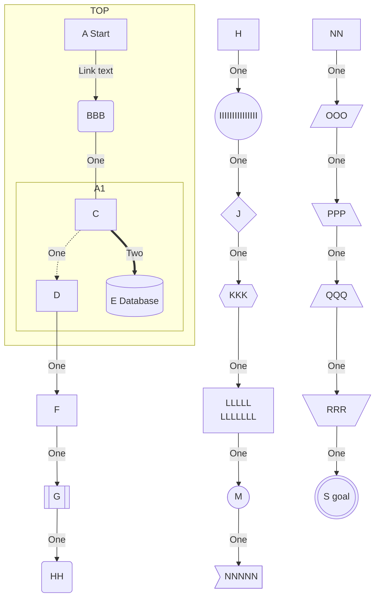
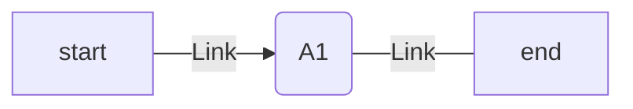

# 概要
https://zenn.dev/zenn/articles/markdown-guide の拡張です。

# 表
https://notepm.jp/markdown-table-tool で作れる。便利。
| Head | Head |
| ---- | ---- |
| Text | Text |
```
| Head | Head |
| ---- | ---- |
| Text | Text |
```

| Head | Head | Head |
| ---- | ---- | ---- |
| Text | Text | Text |
| Text | Text | Text |
```
| Head | Head | Head |
| ---- | ---- | ---- |
| Text | Text | Text |
| Text | Text | Text |
```

| Head | Head | Head | Head |
| ---- | ---- | ---- | ---- |
| Text | Text | Text | Text |
| Text | Text | Text | Text |
| Text | Text | Text | Text |
```
| Head | Head | Head | Head |
| ---- | ---- | ---- | ---- |
| Text | Text | Text | Text |
| Text | Text | Text | Text |
| Text | Text | Text | Text |
```

| Head | Head | Head | Head | Head |
| ---- | ---- | ---- | ---- | ---- |
| Text | Text | Text | Text | Text |
| Text | Text | Text | Text | Text |
| Text | Text | Text | Text | Text |
| Text | Text | Text | Text | Text |
```
| Head | Head | Head | Head | Head |
| ---- | ---- | ---- | ---- | ---- |
| Text | Text | Text | Text | Text |
| Text | Text | Text | Text | Text |
| Text | Text | Text | Text | Text |
| Text | Text | Text | Text | Text |
```

| Head | Head | Head | Head | Head | Head |
| ---- | ---- | ---- | ---- | ---- | ---- |
| Text | Text | Text | Text | Text | Text |
| Text | Text | Text | Text | Text | Text |
| Text | Text | Text | Text | Text | Text |
| Text | Text | Text | Text | Text | Text |
| Text | Text | Text | Text | Text | Text |
```
| Head | Head | Head | Head | Head | Head |
| ---- | ---- | ---- | ---- | ---- | ---- |
| Text | Text | Text | Text | Text | Text |
| Text | Text | Text | Text | Text | Text |
| Text | Text | Text | Text | Text | Text |
| Text | Text | Text | Text | Text | Text |
| Text | Text | Text | Text | Text | Text |
```

# 数式 Latex表記
https://katex.org/docs/support_table.html

$$
e^{i\theta} = \cos\theta + i\sin\theta
$$

```
$$
e^{i\theta} = \cos\theta + i\sin\theta
$$
```

$$
{a \above{2pt} b+1}
$$

```
$$
{a \above{2pt} b+1}
$$
```

$$
\begin{alignedat}{2}
   10&x+ &3&y = 2 \\
   3&x+&13&y = 4
\end{alignedat}
$$

```
$$
\begin{alignedat}{2}
   10&x+ &3&y = 2 \\
   3&x+&13&y = 4
\end{alignedat}
$$
```

# マーメイド記法
記号一覧


````

```` 

:::message
Zennではマーメイドの透明矢印：半角チルダ3連（` ~~~ `）は使えないみたい。
:::

横書き

````

````

https://mermaid-js.github.io/mermaid/#/

# `について
```` ``` ````をコードとして書きたい場合はコードを囲む文字列を````` ```` `````にしましょう。

埋め込む文字列
`````
````
```
```
````
`````

表示
````
```
```
````
https://zenn.dev/link/comments/9ba1c011a6dee3